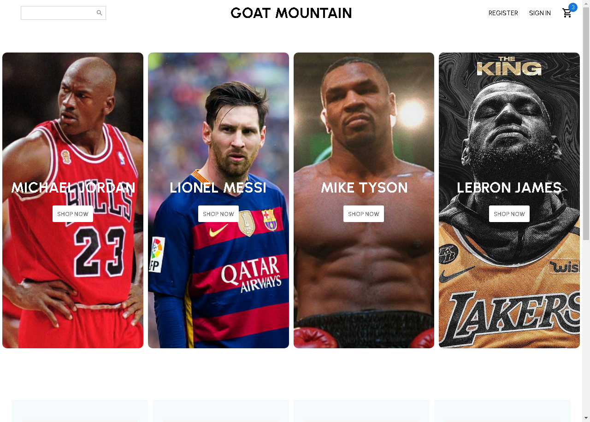
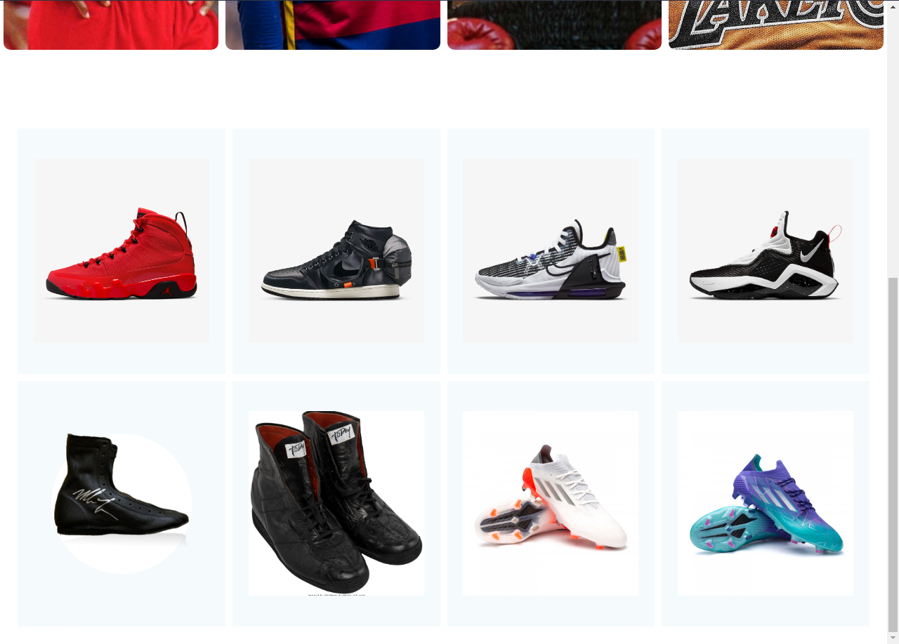
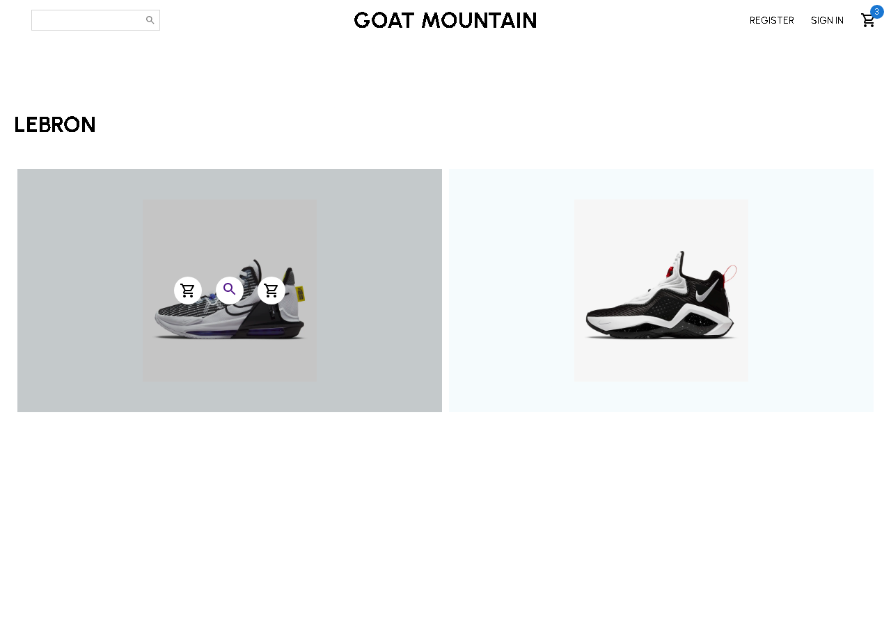
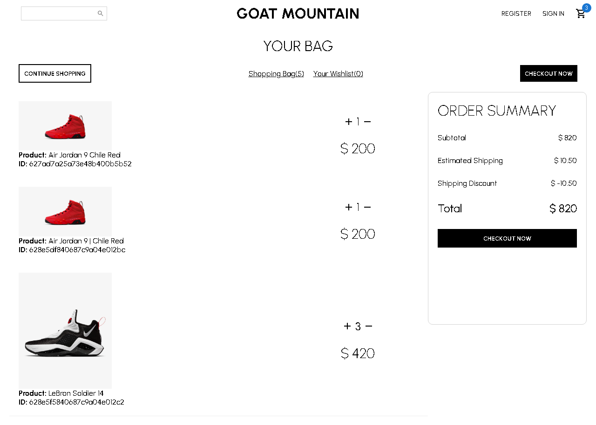
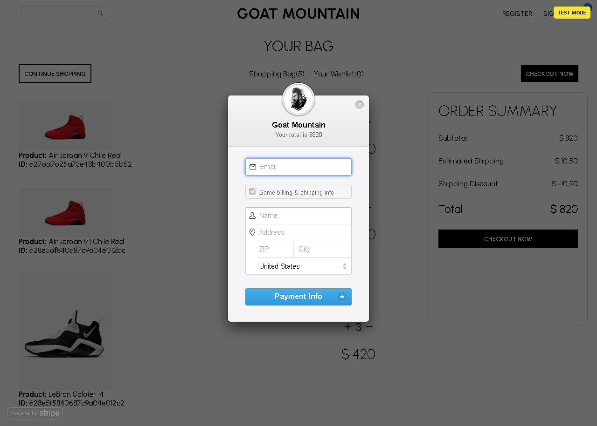

<h1 align="center">Goat Mountain E-Commerce </h1>

## Descrição do projeto

 Projeto em desenvolvimento onde quis homenagear meus atletas preferidos. Criei um ecommerce onde seus produtos serão vendidos e sua marca exposta para todos.

O sistema permite diversas ações como criação de ordem, login do usuário e muito mais. Pretendo adicionar diversas funcionalidades futuramente como dashboard para o admin, diversos tamanhos, cores e quantidades dos produtos.

A interface é completamente responsiva, funcionando tanto em desktop quanto em mobile. Os elementos foram componentizados, seguindo as melhores práticas para que a aplicação tivesse um desempenho melhor.

## Imagens Demonstrativas

<h4 align="center"> 
    :construction:  Projeto em construção  :construction:
</h4>

## :hammer: Funcionalidades do projeto

- `Funcionalidade 1`: Criar usuário
- `Funcionalidade 2`: Logar usuário
- `Funcionalidade 3`: Remover usuário
- `Funcionalidade 4`: Criar carrinho
- `Funcionalidade 5`: Adicionar ao carrinho
- `Funcionalidade 6`: Remover carrinho
- `Funcionalidade 7`: Criar uma ordem
- `Funcionalidade 8`: Realizar pagamento da ordem criada

## 🛠️ Abrir e rodar o projeto

**Instale as dependências necessárias com: yarn** 
**Inicie o projeto com: yarn start**

## ✔️ Tecnologias utilizadas

- `NodeJs`
- `Express`
- `MongoDB`
- `ReactJS`
- `Styled Components`
